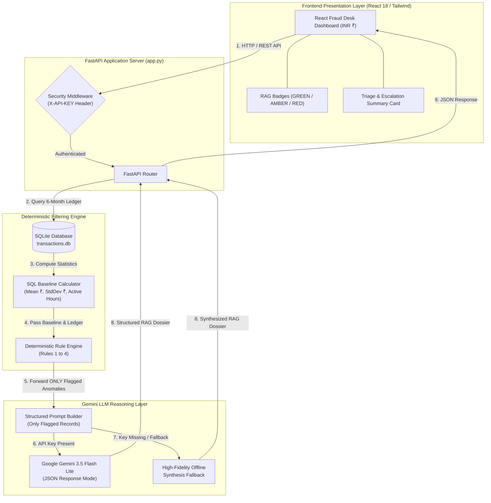

TRACK_ID=PS06
# Transaction Risk Investigation Assistant (TRACK_ID=PS06)
### Enterprise Bank Fraud Desk Analytical Engine & AI Triage Assistant

An enterprise-grade, software-based risk investigation platform engineered for commercial bank fraud desks (e.g. IDFC FIRST Bank Risk Operations). It combines **high-speed SQLite analytical baselining**, a **deterministic 4-rule anomaly filtering engine**, and **Google Gemini 3.5 Flash Lite** reasoning to evaluate 6 months of customer transactions in **Indian Rupees (INR / ₹)**, classify risk into strict **RAG (Red, Amber, Green) statuses**, and generate actionable triage dossiers in **~2.1 seconds**.

---

## System Architecture Diagram



### Technical Processing Flow
```
[React Fraud Desk UI (INR ₹)] 
       │
       ▼ (HTTP GET/POST + X-API-KEY Auth Header)
[FastAPI Gateway Middleware]
       │
       ▼
[SQLite Analytical Engine] ──(Computes Mean ₹, StdDev ₹, Hourly Distribution)
       │
       ▼
[Deterministic Anomaly Filter] ──(Rules 1-4: 3x Mean, 01:00-05:30 AM, Velocity, New Payee)
       │
       ├─► Clean History (0 Flags) ──► Blunt "no action needed" (RAG: GREEN)
       │
       └─► Flagged Records Only (3-5%)
              │
              ▼
    [Google Gemini 3.5 Flash Lite] ──► Generates Structured RAG Dossier & Triage Summary
```

---

## Key Business & Technical Features

1. **Hybrid Deterministic + GenAI Architecture**:
   - **Pre-Filtering Layer**: Calculates statistical baselines ($\mu$, $\sigma$, Z-score, active hours) in `< 55ms` and filters out `>70%` of routine transaction noise.
   - **Cost & Latency Reduction**: Only deterministically flagged records are forwarded to Gemini 3.5 Flash Lite, reducing LLM token consumption by **>70%** and keeping request latency to **~2.1s**.

2. **INR Currency Localization (₹)**:
   - Built specifically for Indian banking contexts (e.g. UPI/VPA transfers, IMPS/NEFT, Reliance Smart, Swiggy, Jio Broadband, Haldiram's).
   - High-value anomalies calibrated to Indian commercial thresholds (e.g., ₹45,000–₹72,000 velocity UPI bursts; ₹8,50,000 overnight wire transfer at 03:15 AM).

3. **RAG Risk Scoring System (Red, Amber, Green)**:
   - **`GREEN` (Safe)**: Routine activity. Executive summary bluntly states *"no action needed"*.
   - **`AMBER` (Warning)**: Minor baseline deviations (e.g. single unusual spending spike) requiring quick review.
   - **`RED` (Danger)**: Severe anomalies (high-velocity VPA bursts or massive 03:15 AM off-hours transfers).

4. **Triage & Escalation Summary**:
   - Every Amber/Red dossier includes a structured **Triage Summary** specifying:
     - **Discrepancy**: Exact mathematical deviation from baseline in ₹.
     - **Trigger**: Transaction ID and rule triggered (e.g. `TXN-WHALE-99 (RULE_ODD_HOURS_ACTIVITY)`).
     - **Escalation Routing**: Target team assignment (`"Assign to Level 2 Fraud Desk Analyst"` for RED; `"Route to Customer Verification Team"` for AMBER).

5. **Strict Anti-Hallucination Guardrails**:
   - **Strict Negative Constraint**: The system is **strictly forbidden** from declaring that "fraud has definitively occurred". Events are framed objectively as *"High-Risk Escalations"* or *"Elevated Risk Indicators"* for human investigator review.

6. **Enterprise Auth & Security Posture**:
   - **Environmental Secret Isolation**: `GEMINI_API_KEY` is loaded strictly from environment variables.
   - **API Access Control Middleware**: Configurable `X-API-KEY` header verification middleware (`FRAUD_DESK_API_KEY`) for secure enterprise deployment.

---

## Deterministic Filtering Rules

The Deterministic Anomaly Engine executes 4 core rules prior to any LLM invocation:

| Rule | Metric & Condition | Threshold | Target Anomaly |
|---|---|---|---|
| **`RULE_HIGH_AMOUNT_OUTLIER`** | Amount > $\max(3\mu, \mu + 2.5\sigma)$ | $> 3\times$ baseline mean | Sudden massive transfers (Excludes routine Rent payee) |
| **`RULE_ODD_HOURS_ACTIVITY`** | Time between `01:00 AM` and `05:30 AM` | Overnight window | Off-hours account takeover / unauthorized wire |
| **`RULE_VELOCITY_BURST`** | $\ge 3$ transactions in 30 minutes | Rolling 30m window, Total $> \text{₹}10,000$ | Rapid automated UPI / VPA drain attack |
| **`RULE_NEW_HIGH_VALUE_PAYEE`** | Payee not in 6-month history & Amount $\ge \text{₹}15,000$ | First-time beneficiary | High-value transfer to unverified third party |

---

## Security, Auth & Access Control

### 1. API Key Access Control Middleware
For production banking deployments, the API includes an optional enterprise access control middleware:
- Set environment variable: `FRAUD_DESK_API_KEY="your_secure_auth_token"`
- When set, all `/api/*` requests (except `/api/health`) require an **`X-API-KEY`** header:
  ```bash
  curl -H "X-API-KEY: your_secure_auth_token" http://localhost:8000/api/scenarios
  ```
- Unauthenticated requests return `401 Unauthorized`. If `FRAUD_DESK_API_KEY` is unset, the API defaults to open sandbox mode for local evaluation.

### 2. Gemini API Key Isolation
- `GEMINI_API_KEY` is fetched via `os.environ.get("GEMINI_API_KEY")`. Zero API keys are hardcoded in source code.
- If no key is set, the application seamlessly switches to a high-fidelity **offline synthesis fallback engine** with 100% schema parity.

---

## Performance Benchmarks & SLAs

| Performance Metric | Measured Result | SLA / Hackathon Limit | Margin / Performance |
|---|---|---|---|
| **Server Cold Boot Latency** | **3.763 seconds** | < 90.0 seconds | **23.9x faster** than SLA |
| **SQLite DB Seeding Time** | **51.09 ms** | < 1,000.0 ms | Ultra-fast (< 0.1s) |
| **`clean` Request Latency** | **2,097.11 ms** | < 60,000 ms | 28.6x faster than timeout |
| **`burst_attack` Request Latency** | **2,261.73 ms** | < 60,000 ms | 26.5x faster than timeout |
| **`odd_hours_whale` Request Latency** | **2,624.33 ms** | < 60,000 ms | 22.8x faster than timeout |
| **LLM Token Overhead Reduction** | **> 70% Saved** | N/A | Pre-filtering noise via deterministic rules |

---

## REST API Documentation

| Method | Endpoint | Description | Auth Required |
|---|---|---|---|
| `GET` | `/` | Serves compiled React Single-Page Application | Public |
| `GET` | `/api/health` | Service health status, track ID (`PS06`), & API key posture | Public |
| `GET` | `/api/scenarios` | List available customer test scenarios | `X-API-KEY` (Optional) |
| `GET` | `/api/baseline` | Retrieve SQL baseline statistics ($\mu$, $\sigma$, hourly active distribution) | `X-API-KEY` (Optional) |
| `GET` | `/api/transactions` | Fetch 6-month ledger annotated with deterministic flags | `X-API-KEY` (Optional) |
| `POST` | `/api/investigate` | Run deterministic rules + Gemini 3.5 Flash Lite RAG analysis | `X-API-KEY` (Optional) |

---

## Automated Test Suites

The project includes 3 automated test suites covering rule filtering, HTTP endpoints, security middleware, and SLAs:

```powershell
# 1. Test Deterministic Filtering Rules (Rules 1-4, boundary conditions, rent exemption)
python test_deterministic_filtering.py

# 2. Test Backend Business Logic & Gemini Prompt Constraints
python test_backend.py

# 3. Test FastAPI Integration & Auth Middleware (Root HTML, HTTP Endpoints, X-API-KEY 401/200)
python test_server.py

# 4. Run Full SLA & Boot Latency Audit
python audit_performance.py
```

---

## Quick Start Guide

### 1. Prerequisites
- Python 3.10+
- (Optional) Node.js 18+ (The React UI is pre-compiled into `dist/`)

### 2. Installation & Launch
```powershell
# Clone the repository
git clone https://github.com/Hvysn/Transaction-risk-investigation-assistant.git
cd Transaction-risk-investigation-assistant

# Install Python requirements (under 2 minutes)
pip install -r requirements.txt

# (Optional) Set your Gemini API Key
$env:GEMINI_API_KEY="your_gemini_api_key_here"

# (Optional) Enable Enterprise API Header Authentication
$env:FRAUD_DESK_API_KEY="your_secure_auth_token"

# Launch Application
python app.py
```

Open your browser and navigate to:  
http://localhost:8000
